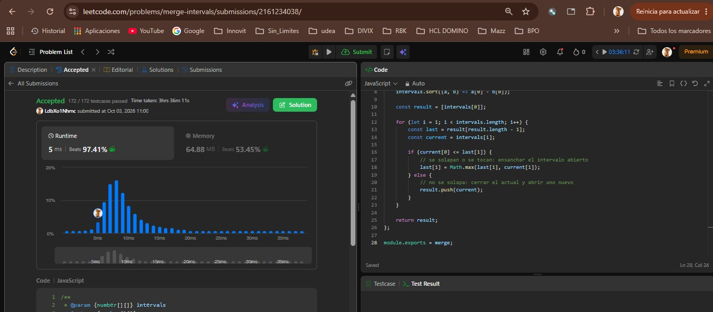
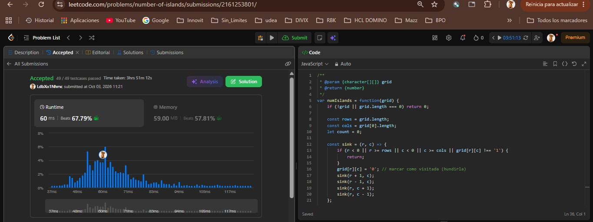
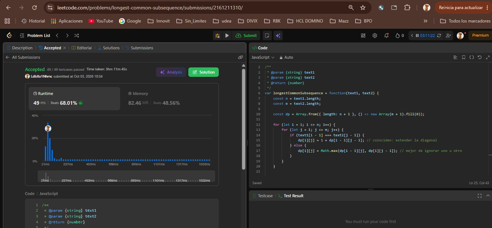
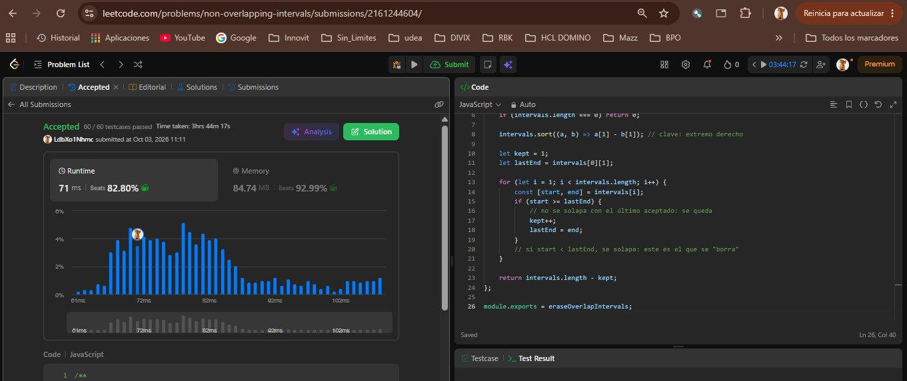
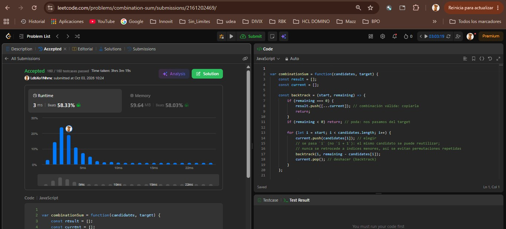

# Taller — Cinco familias en LeetCode

Un problema Medium por cada familia vista en el curso: ordenamiento,
grafos, programación dinámica, greedy y backtracking.

## Ejercicios

| # | Familia | Problema | Código | Evidencia |
|---|---|---|---|---|
| 1 | Ordenamiento | [56. Merge Intervals](https://leetcode.com/problems/merge-intervals/) | [`merge-intervals/merge-intervals.js`](./merge-intervals/merge-intervals.js) | [`evidencias/merge-intervals-accepted.jpg`](./evidencias/merge-intervals-accepted.jpg) |
| 2 | Grafos | [200. Number of Islands](https://leetcode.com/problems/number-of-islands/) | [`number-of-islands/number-of-islands.js`](./number-of-islands/number-of-islands.js) | [`evidencias/number-of-islands-accepted.jpg`](./evidencias/number-of-islands-accepted.jpg) |
| 3 | Programación dinámica | [1143. Longest Common Subsequence](https://leetcode.com/problems/longest-common-subsequence/) | [`longest-common-subsequence/longest-common-subsequence.js`](./longest-common-subsequence/longest-common-subsequence.js) | [`evidencias/longest-common-subsequence-accepted.jpg`](./evidencias/longest-common-subsequence-accepted.jpg) |
| 4 | Greedy | [435. Non-overlapping Intervals](https://leetcode.com/problems/non-overlapping-intervals/) | [`non-overlapping-intervals/non-overlapping-intervals.js`](./non-overlapping-intervals/non-overlapping-intervals.js) | [`evidencias/non-overlapping-intervals-accepted.jpg`](./evidencias/non-overlapping-intervals-accepted.jpg) |
| 5 | Backtracking | [39. Combination Sum](https://leetcode.com/problems/combination-sum/) | [`combination-sum/combination-sum.js`](./combination-sum/combination-sum.js) | [`evidencias/combination-sum-accepted.jpg`](./evidencias/combination-sum-accepted.jpg) |

## 56. Merge Intervals

ordenamiento.

La entrada no viene ordenada, así que primero se elige la
 (el extremo izquierdo `start`) y se ordena. Luego, una sola
pasada izquierda→derecha mantiene un intervalo "abierto": si el
siguiente empieza antes o justo cuando termina el actual, se ensancha
el `end`; si no, se cierra el actual y se abre uno nuevo. Es el mismo
patrón de fusión del laboratorio de despacho, pero sobre una sola
corrida que hay que ordenar primero.

Complejidad(con `n = intervals.length`):
 Tiempo: `O(n log n)` — dominado por el sort; la fusión es `O(n)`.
 Espacio: `O(n)` para la salida (más lo que use el sort internamente).

## 200. Number of Islands

Familia: grafos.

El grafo está implícito en la grilla. Modelo: cada celda
`'1'` es un vértice; hay arista (no dirigida) a la vecina
ortogonal (arriba, abajo, izquierda, derecha) que también sea `'1'`
sin diagonales. Contar islas es contar componentes conexas: se
recorre la grilla y, cada vez que aparece un `'1'` no visitado, se
suma una isla y un DFS "hunde" (marca) toda esa componente para no
volver a contarla.

Complejidad(con `m` filas, `n` columnas):
 Tiempo: `Θ(m·n)` — cada celda se visita una sola vez.
 Espacio: `O(m·n)` en el peor caso, por la pila de recursión del DFS.

## 1143. Longest Common Subsequence

Familia: programación dinámica.

 `dp[i][j]` = longitud de la LCS entre `text1[0..i)` y
`text2[0..j)`. Caso base: `dp[0][j] = dp[i][0] = 0` (prefijo vacío).
Recurrencia: si `text1[i-1] === text2[j-1]`, se extiende la diagonal
con `dp[i][j] = 1 + dp[i-1][j-1]`; si no, se toma el mejor de ignorar
un carácter de cualquiera de las dos cadenas: `dp[i][j] = max(dp[i-1][j], dp[i][j-1])`.
Es subsecuencia, no substring contiguo, así que no basta un greedy de
(tomar la primera coincidencia).

Complejidad(con `n = text1.length`, `m = text2.length`):
 Tiempo: `Θ(n·m)` — se llena toda la tabla.
 Espacio: `Θ(n·m)` con la matriz completa (o `Θ(min(n, m))` si se
 comprime a dos filas; esta solución usa la matriz completa).

## 435. Non-overlapping Intervals

Familia:greedy.

Es selección de actividades al revés — maximizar cuántos
intervalos caben sin solape equivale a minimizar cuántos se borran.
Criterio local: ordenar por el extremo derecho (`end`) y, entre
los candidatos que aún caben, quedarse siempre con el que termina
antes(`start >= lastEnd`). Lo que no se elige en cada paso es lo
que se cuenta como "borrado". Tocarse en el mismo punto (`end == start`
del siguiente) no cuenta como solape.

Complejidad (con `n = intervals.length`):
- Tiempo: `O(n log n)` — dominado por el sort; la pasada greedy es `O(n)`.
- Espacio: `O(1)` extra (el sort de JS ordena in-place sobre el arreglo).

## 39. Combination Sum

**Familia:** backtracking.

**Idea:** hay que **enumerar**, no solo contar u optimizar (a
diferencia de Coin Change). Estado de la búsqueda: índice desde el
que se puede tomar, cuánto falta por sumar y la combinación actual.
En cada paso se **elige** `candidates[i]` y se permite **reutilizarlo**
(la siguiente llamada sigue en `i`, nunca retrocede a índices
menores, para no generar permutaciones repetidas de la misma
combinación). Si la suma iguala el `target`, se copia la combinación;
si se pasa, se corta la rama (poda). Al volver de la recursión se
**deshace** la última elección (`pop`) — eso es el backtrack.

**Complejidad** (con `n = candidates.length`, `t = target`):
- Tiempo: exponencial en la profundidad del árbol de búsqueda —
  en el peor caso (candidato mínimo repetido muchas veces) del orden
  de `O(n^(t / min(candidates)))`.
- Espacio: `O(t / min(candidates))` de profundidad de pila, más el
  tamaño de la salida (todas las combinaciones encontradas).

