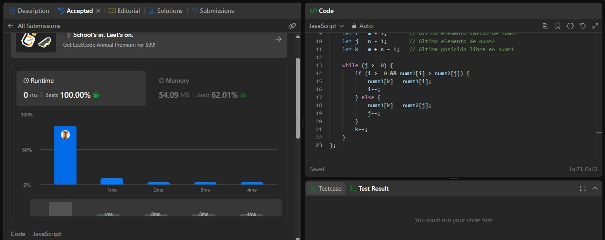
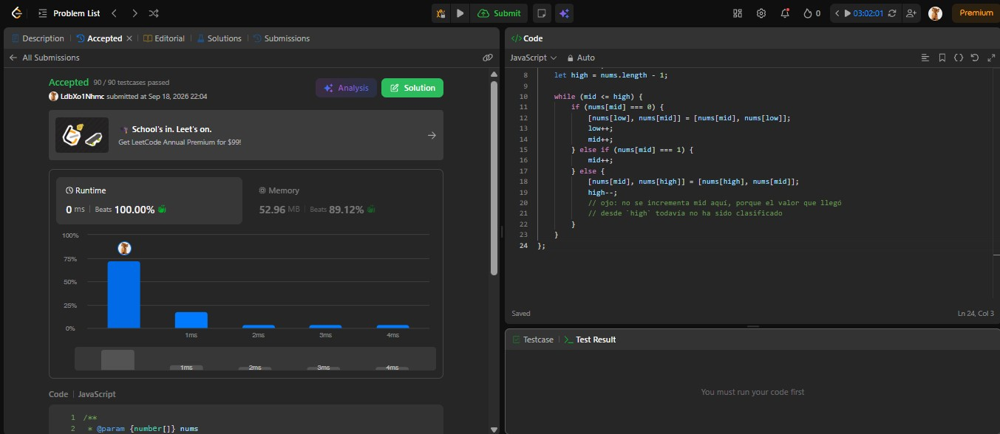

# Tarea 2 · Algoritmos de ordenamiento en LeetCode

**Curso:** Análisis de algoritmos · ITM · 2026-2

## 88. Merge Sorted Array

**Enlace:** https://leetcode.com/problems/merge-sorted-array/

**Algoritmo:** fusión de dos corridas ya ordenadas (`nums1[0..m)` y `nums2[0..n)`),
escrita **desde el final** (`m + n - 1`) hacia atrás. Se usan dos punteros que
recorren las colas de ambas corridas; en cada paso se coloca en la posición libre
más alta el mayor de los dos elementos comparados. Se escribe desde el final para
no sobrescribir valores de `nums1` que todavía no han sido consumidos. No se usó
un sort comparativo de propósito general porque las dos entradas ya están
ordenadas: concatenar y ordenar sería `O((m+n) log(m+n))`, mientras que aprovechar
que ya son corridas ordenadas permite hacer el merge en tiempo lineal.

**Complejidad:**
- Tiempo: `O(m + n)` — cada elemento de ambos arreglos se visita exactamente una vez.
- Espacio: `O(1)` extra — la fusión se hace in-place dentro de `nums1`.

---

## 75. Sort Colors

**Enlace:** https://leetcode.com/problems/sort-colors/

**Algoritmo:** partición de tres vías (bandera holandesa / *Dutch National Flag*),
de una sola pasada, con tres punteros: `low`, `mid` y `high`. El puntero `mid`
recorre el arreglo; si encuentra un 0 lo intercambia hacia la zona de `low` y
avanza ambos; si encuentra un 1 simplemente avanza `mid`; si encuentra un 2 lo
intercambia hacia la zona de `high` y retrocede `high` (sin avanzar `mid`, porque
el valor que llega desde `high` aún no ha sido clasificado). No se usó un sort
comparativo porque el universo de claves es `k = 3` (0, 1, 2): en vez de comparar
elementos entre sí para inferir un orden general, solo se clasifica cada elemento
en una de tres cubetas fijas, lo que permite bajar de `Θ(n log n)` a `O(n + k)`.
Esto no viola la cota `Ω(n log n)` del modelo de comparaciones porque esa cota
aplica quien ordena `n` claves arbitrarias comparándolas entre sí; aquí `k` es
constante y conocido de antemano, así que el problema cae fuera de ese modelo.

**Complejidad:**
- Tiempo: `O(n)` — una sola pasada sobre el arreglo (`n + k` con `k = 3`, que es `O(n)`).
- Espacio: `O(1)` extra — solo los tres punteros e intercambios in-place.

